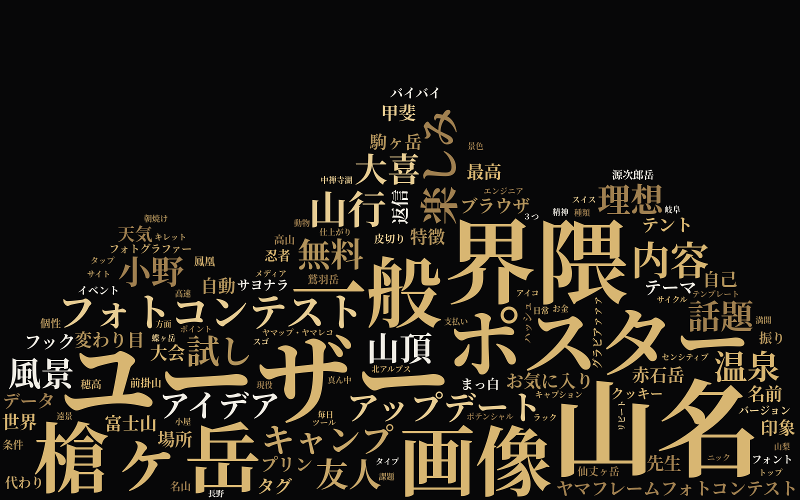
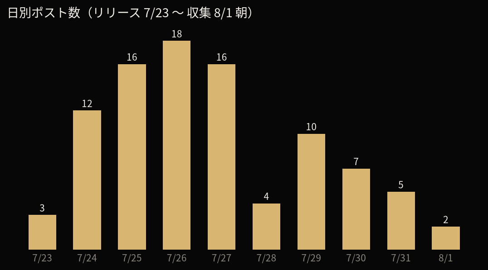
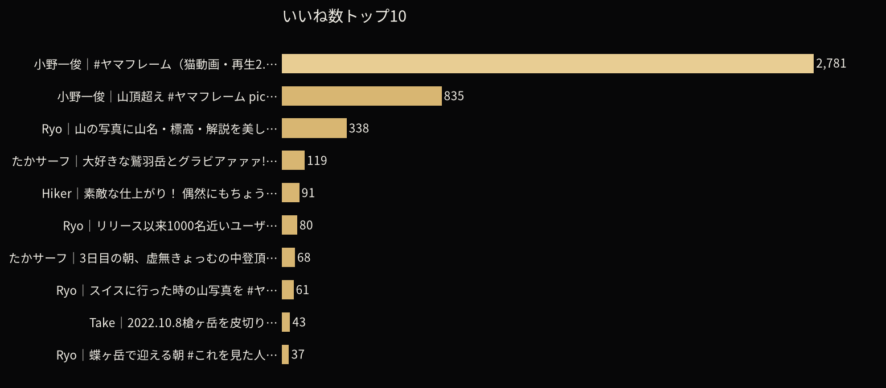
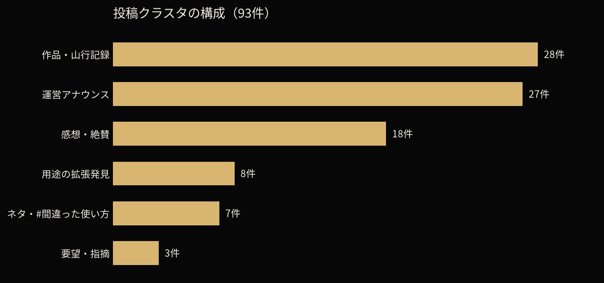
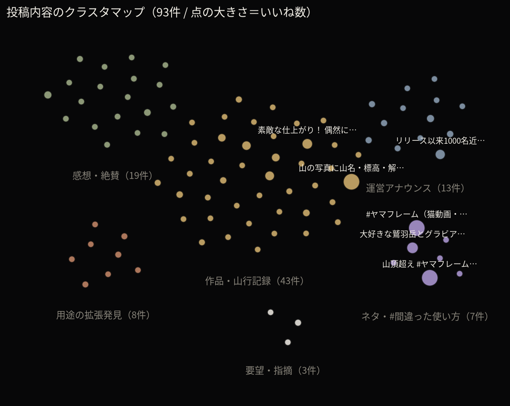

# ヤマフレーム Xポスト フル解析レポート（93件 / 2026-08-01時点）

データ: `yamaframe_x_posts_2026-08-01.csv`
収集方法: Yahoo!リアルタイム検索（「#ヤマフレーム」77件＋タグなし「ヤマフレーム」の新規15件＋個別確認で発見した1件）

## サマリー

- リリース（7/23）から約1週間で93件の言及、批判ゼロ。ユーザー数は運営発表で 24hで700人 → 2日で1000人 → 1週間で1700人。
- いいねトップは「間違った使い方」ネタ（本文ハッシュタグのみの猫動画2,781いいね・再生2.3万、次点も猫の山頂超え835いいね）。バズはネタ枠、継続利用は山行記録と用途拡張が支える二層構造。
- 実質的な改善要望は3件のみで、うち1件（山名の改行）は実装済み。

## ワードクラウド

投稿本文から名詞を抽出（アプリ名・URL・ハッシュタグ・一般語は除外、`generate_wordcloud.py` で再生成可能）。

### 通常版

### 山型版

### 頻出語トップ20

| 語 | 回数 | 語 | 回数 |
|---|---|---|---|
| 山名 | 8 | 友人 | 3 |
| ユーザー | 7 | 小野 | 3 |
| 界隈 | 6 | 山頂 | 3 |
| 槍ヶ岳 | 4 | 話題 | 3 |
| ポスター | 4 | 無料 | 3 |
| 画像 | 4 | 試し | 3 |
| 一般 | 4 | 風景 | 3 |
| フォトコンテスト | 3 | 大喜（利） | 3 |
| 山行 | 3 | アップデート | 3 |
| 内容 | 3 | 楽しみ | 3 |

機能語（山名・ポスター・無料・アップデート）と実際の山名（槍ヶ岳ほか赤石岳・富士山・剱岳など）が混在しており、機能の話題と作品投稿が両輪で回っていることがわかる。

## 日別ポスト数の推移

リリース直後 7/24〜27 が山（ピークは 7/26 の18件）。7/28 に一旦落ち着くも、7/29 の猫バズ・7/31 のフォトコンテスト発表で持ち直しており、単調減衰ではなくイベント駆動で波が作れている。

## エンゲージメント

### いいね数トップ10

| いいね | アカウント | 内容 |
|---|---|---|
| 2,781 | 小野一俊 @kazutoshi_ono_ | 猫動画（本文は #ヤマフレーム のみ・再生2.3万） |
| 835 | 小野一俊 @kazutoshi_ono_ | 猫の「山頂超え」 #間違った使い方 |
| 338 | Ryo Takano @r_outdoor_photo | リリース告知（山名・標高・解説を重ねるアプリ） |
| 119 | たかサーフ @taka_SURF2018 | 鷲羽岳とグラビア #間違った使い方 |
| 91 | Hiker アルパカ @Hiker_alpaca_mt | 長野と岐阜が光と影で分かれた一枚 |
| 80 | Ryo Takano | アップデート告知（そのまま使うモード） |
| 68 | たかサーフ | 槍ヶ岳 山行記録 |
| 61 | Ryo Takano | スイスの山写真を編集 |
| 43 | Take @Takeochiro | 3000m峰21座完登記念 |
| 37 | Ryo Takano | 蝶ヶ岳の朝 |

### 投稿数上位アカウント

@r_outdoor_photo（運営）30件、@komasaburo0287 6件、@kazutoshi_ono_ / @taka_SURF2018 / @mt_climber 各3件。運営以外に複数回投稿するリピーターが少なくとも7アカウント存在。

## 感情分析

| 分類 | 件数目安 | 備考 |
|---|---|---|
| ポジティブ | 約85件 | 絶賛・作品投稿・ネタ投稿含む |
| 中立 | 約5件 | 淡々とした作品投稿・運営告知 |
| ネガティブ（批判） | 0件 | アプリへの不満は見当たらず |
| 改善要望・指摘 | 3件 | 下記参照 |

### ポジティブの代表的な声
- 「狂おしいほど楽しい」「神アプリ」「これはオシャレ…」
- 「iPhoneで撮影した私の写真ですら、まるで写真集みたいに」
- 「適当にやっただけでめっちゃいい感じになるんだけどなぜ無料？？」
- 「Photoshopいじるまでもない手軽さ、オシャレな感じが良い」
- 「文字入れ画像作るのっていちいちめんどくさい（のを解決）」← 提供価値の言語化
- キーワード: 簡単 / 無料 / 登録不要 / ダウンロード不要 / 手軽

### 改善要望・指摘（実質的なTODO）
1. **山名を消しても引き出し線が消えない**（@baru_tozan）
   ユーザーが回避策（線のTOを最下部へ伸ばし山頂名をドラッグ移動）を自力発見して共有。UXバグ。
2. **桜島が山岳辞書にヒットしない**（辞書の網羅性）
   運営が「アップデート案とする」と回答済み。
3. **自由記入の山名で改行したい**（@mits3244）
   → 改行機能として実装済み（公開版にも反映済み）。

### 新機能アイデア（ユーザー発）
- 「他の人が投稿されたものを山別に見てみたい」→ 山別ギャラリー/アーカイブ
- ポスター印刷したい
- 旅Vlog風フォント（運営も検討表明）

## クラスタリング（6グループ）

クラスタマップは全93件を1投稿＝1点で配置したもの（点の大きさ＝いいね数、`generate_cluster_map.py` で再生成可能）。点の色分けはキーワードルールによる自動分類のため、下記の手動クラスタリングとは件数が多少ずれる（例: 引用リポストで感想が本文に含まれる投稿は自動分類だと「感想・絶賛」に寄る）。ネタ枠がわずか6件で全いいねの4割超を稼いでいるのが視覚的にわかる。

1. **運営アナウンス**（約27件）
   ユーザー数推移（24hで700人→2日で1000人→1週間で1700人）、アップデート告知、フォトコンテスト開催、協賛（itomici等）。
2. **作品・山行記録投稿**（約28件）
   槍ヶ岳・聖岳・赤石岳・塩見岳・剱岳・富士山・谷川岳など。本来の想定用途。過去写真の再活用（「昔の山行を振り返るのも良き」「雪山行きたくなってきた」）も目立つ。
3. **感想・絶賛**（約18件）
4. **ネタ・大喜利 #間違った使い方**（約6件）
   猫の「山頂超え」835いいね（全体トップ）、グラビア119いいね。運営の「絶対にやるなよ？」公認が拡散を後押し。
5. **用途の拡張発見**（約8件）
   キャンプ・温泉・ツーリング・海外の山・動物写真・YAMAPカバー画像の統一・Exifフォトフレームとの併用。
6. **要望・指摘**（3件）

## 示唆

- いいね上位は「間違った使い方」ネタ（2,781/835/119）と公式リリース告知（338）。**バズの主エンジンはネタ枠**、継続利用のコアはクラスタ2と5。
- 撮影段階から「ヤマフレーム前提で撮る」ユーザーが出現（行動変容）。
- 「青プリン先生（山座同定リプライbot的アカウント）」との比較言及あり。競合というより界隈の文化として共存。
- ネガティブゼロは初週バイアス（好意的な人しか投稿しない）の可能性もあるため、継続的にウォッチ推奨。

## 注意事項
- Yahoo!リアルタイム検索は直近期間のみ・リプライは部分的にしか拾えないため、全言及の完全網羅ではない。本文がハッシュタグのみの投稿も漏れることがある（猫動画2,781いいねは個別確認で発見）。
- いいね等の数値は収集時点の表示値。
