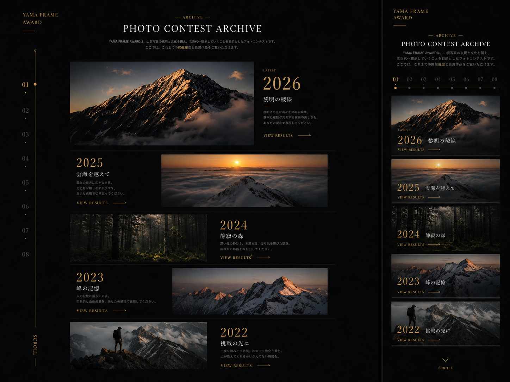
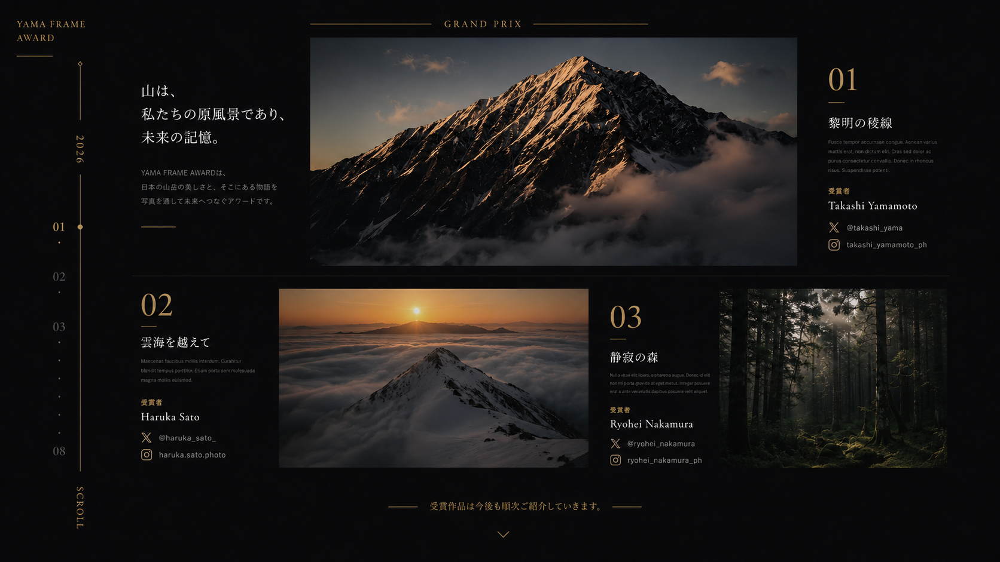
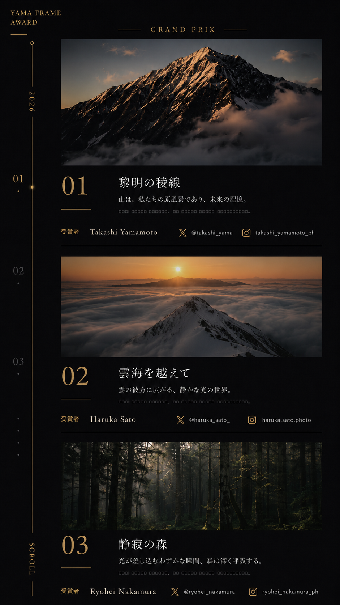

# フォトコンテストページ実装要件

あなたは、既存Webサイトのデザインを高い精度で再現し、保守性の高い構成へ落とし込むシニアフロントエンドエンジニアです。

このドキュメントと参考画像をもとに、既存プロジェクト内へ以下のページを実装してください。

1. フォトコンテスト一覧ページ
2. 年度ごとのフォトコンテスト結果ページ

参考画像は単なる雰囲気の参考ではありません。

レイアウト、余白、文字サイズ、文字間隔、画像比率、配置、配色、罫線、ナビゲーション、レスポンシブ時の構成などを可能な限り忠実に再現してください。

ただし、参考画像そのものをWebページの背景画像として使用したり、参考画像を切り抜いてUIパーツとして使用したりしないでください。

HTML、CSS、Reactコンポーネントなどを使用し、実際に動作するレスポンシブなWebページとして再構築してください。

---

# 参考画像

## 1. フォトコンテスト一覧ページ

参照ファイル：

```text
docs/photo-contest/references/archive-page-desktop-mobile.png
```

この画像には以下が含まれています。

- 左側：PC版のフォトコンテスト一覧ページ
- 右側：スマートフォン版のフォトコンテスト一覧ページ



---

## 2. フォトコンテスト結果ページ：PC版

参照ファイル：

```text
docs/photo-contest/references/result-page-desktop.png
```



---

## 3. フォトコンテスト結果ページ：スマートフォン版

参照ファイル：

```text
docs/photo-contest/references/result-page-mobile.png
```



---

# 参考画像の優先順位

参考画像に具体的なレイアウトが描かれている場合は、文章から推測される一般的なWebデザインよりも、参考画像を優先してください。

特に、スマートフォン版のナビゲーションはページによって異なります。

## 一覧ページのスマートフォン版

- 横方向の番号ナビゲーションを使用する
- PC版の左サイドナビゲーションは表示しない

## 結果ページのスマートフォン版

- 左側の縦型ナビゲーションを維持する
- 横方向ナビゲーションへ変更しない
- 本文を左側ナビゲーションの右側へ配置する

一覧ページと結果ページのスマートフォン版で、同じナビゲーションレイアウトを使用しないでください。

共通化によって参考画像の再現性が下がる場合は、無理に完全共通化しないでください。

色、番号、アクティブ状態、スクロール検出などの共通ロジックは共有し、レイアウトはページごとのバリエーションとして実装してください。

---

# 最重要：最初は実装しないでください

最初の返答では、コードやファイルを変更しないでください。

まず、この要件書と3つの参考画像を確認してください。

その後、既存プロジェクトを調査し、実装内容に対する理解と方針だけを説明してください。

以下を確認してください。

1. 現在の技術スタック
2. 使用しているフレームワークとバージョン
3. 既存のルーティング構成
4. 既存サイトの共通レイアウト
5. 既存サイトで使用しているフォント
6. 既存サイトの色とデザイントークン
7. 既存の共通コンポーネント
8. CSSの管理方法
9. 使用可能なアイコンライブラリ
10. 既存プロジェクト内にある利用可能な画像素材
11. `package.json`
12. `CLAUDE.md`
13. `AGENTS.md`
14. `README`
15. その他の開発指示ファイル
16. 実行可能なlint、typecheck、build、testコマンド
17. 添付画像から読み取ったUI構成
18. PC版とスマートフォン版の実装方針
19. コンポーネントの分割方針
20. コンテンツデータの管理方法
21. 追加・変更予定のファイル
22. 不足している画像素材
23. 実装前に確認が必要な事項

特に、以下を具体的に説明してください。

- タイトルをどのファイルで変更するか
- 解説文をどのファイルで変更するか
- 画像をどのフォルダへ配置するか
- 受賞者名をどのファイルで変更するか
- Xの表示名とURLをどのファイルで変更するか
- Instagramの表示名とURLをどのファイルで変更するか
- 受賞作品を追加・削除する方法
- 作品の表示順を変更する方法
- 新しい年度を追加する方法
- 最新年度を変更する方法
- 公開・非公開を切り替える方法
- 上記の更新時に`.tsx`を編集する必要がないこと

最初の返答では、コードやファイルを変更しないでください。

最初の返答の最後は、必ず次の確認で終えてください。

> 以上の理解と実装方針で進めてよいでしょうか。確認後に実装を開始します。

私が承認するまでは、実装を開始しないでください。

---

# 実装対象URL

既存プロジェクトにURLの命名規則がある場合は、その規則を優先してください。

想定URLは以下です。

## フォトコンテスト一覧ページ

```text
/photo-contest
```

## 年度別結果ページ

```text
/photo-contest/[year]
```

例：

```text
/photo-contest/2026
```

年度ごとにページコンポーネントを複製しないでください。

共通の動的ルートとコンポーネントで、年度別コンテンツを表示してください。

---

# 1. フォトコンテスト一覧ページ

## PC版

参考画像：

```text
docs/photo-contest/references/archive-page-desktop-mobile.png
```

画像左側のPC版デザインを基準にしてください。

ページ全体は、黒に近い背景を使用した、高級感のあるエディトリアルデザインにします。

一般的なカード一覧ページではなく、写真集、展覧会、美術館、ハイエンドなポートフォリオサイトのような印象にしてください。

---

## PC版：左側固定ナビゲーション

画面左側へ縦長の固定ナビゲーションを配置してください。

含める要素：

- 「YAMA FRAME AWARD」のロゴテキスト
- ロゴ下部の短いゴールドライン
- 縦方向の細いゴールドライン
- コンテストに対応する番号
- 現在表示中の項目を示すゴールドの丸
- 非アクティブ項目を示す小さなドット
- 下部の縦書き「SCROLL」

参考画像では`01`〜`08`が表示されていますが、実際の番号は公開中のコンテスト数に応じて動的に生成してください。

ページをスクロールすると、現在表示されているコンテストに対応してアクティブ番号が切り替わるようにしてください。

番号をクリックすると、対応するコンテスト位置まで移動できるようにしてください。

Intersection Observerなど、既存プロジェクトに適した方法を使用してください。

`prefers-reduced-motion`が有効な場合は、過剰なスムーズスクロールを避けてください。

固定ナビゲーションが本文を隠さないようにしてください。

---

## PC版：ページヘッダー

中央上部に以下を配置してください。

- 小さな「— ARCHIVE —」
- 大きな英字見出し「PHOTO CONTEST ARCHIVE」
- 日本語の説明文

参考文言：

```text
YAMA FRAME AWARDは、山岳写真の表現と文化を讃え、
次世代へ継承していくことを目的としたフォトコンテストです。
ここでは、これまでの開催履歴と受賞作品をご覧いただけます。
```

これらの文言は`.tsx`へ直接記述せず、コンテンツファイルから変更できるようにしてください。

文字サイズ、文字間隔、行間、上下余白を参考画像に近づけてください。

---

## PC版：コンテスト一覧

年度ごとのコンテストを縦に並べてください。

初期表示用の参考データ：

- 2026「黎明の稜線」
- 2025「雲海を越えて」
- 2024「静寂の森」
- 2023「峰の記憶」
- 2022「挑戦の先に」

これらのデータを`.tsx`へ直接記述しないでください。

### 最新コンテスト

最新年度は、他の年度より大きく表示してください。

含める要素：

- `LATEST`
- 年度
- コンテストタイトル
- 短い説明文
- `VIEW RESULTS`
- 右向きの細いラインまたは矢印
- 大きなメインビジュアル

参考画像のように、写真を大きく見せ、その隣に年度と情報を配置してください。

### 過去コンテスト

過去年度は、画像とテキストを左右交互に配置してください。

例：

- 2025：左にテキスト、右に画像
- 2024：左に画像、右にテキスト
- 2023：左にテキスト、右に画像
- 2022：左に画像、右にテキスト

年度や表示順が変わっても、配列の順番をもとに交互配置できるようにしてください。

各コンテスト間には、非常に薄い罫線を配置してください。

以下は使用しないでください。

- 強い境界線
- 一般的な角丸カード
- 白いカード背景
- 強いドロップシャドウ
- 塗りつぶされた一般的なCTAボタン

各コンテストの`VIEW RESULTS`またはクリック可能な領域を操作すると、該当年度の結果ページへ遷移するようにしてください。

---

# 一覧ページ：スマートフォン版

参考画像：

```text
docs/photo-contest/references/archive-page-desktop-mobile.png
```

画像右側のスマートフォン版を基準にしてください。

PC版を単純に縮小せず、参考画像に合わせてスマートフォン向けに再構成してください。

---

## スマートフォン版：上部

以下を配置してください。

- 左上に「YAMA FRAME AWARD」
- ロゴ下部の短いゴールドライン
- 中央に「— ARCHIVE —」
- 「PHOTO CONTEST ARCHIVE」
- 日本語の説明文

---

## スマートフォン版：横方向ナビゲーション

一覧ページのスマートフォン版では、PC版の左側固定ナビゲーションを表示しないでください。

説明文の下に横方向の番号ナビゲーションを配置してください。

含める要素：

- 公開中のコンテスト数に応じた番号
- 横方向の細いライン
- 各番号に対応するドット
- 現在位置を示すゴールド表現

画面幅に収まらない場合も、不自然な改行を発生させないでください。

必要な場合は横スクロール可能にして構いませんが、スクロールバーがデザインを損なわないようにしてください。

番号をタップすると、対応するコンテスト位置へ移動できるようにしてください。

---

## スマートフォン版：コンテスト一覧

各コンテストを、横幅いっぱいに近い画像セクションとして縦に配置してください。

各セクションには以下を表示してください。

- 年度
- タイトル
- `LATEST`
- `VIEW RESULTS`
- 細い矢印

参考画像のように、文字を画像下部へ重ねる構成にしてください。

可読性を確保するため、画像下部へごく薄い黒のグラデーションを重ねても構いません。

ただし、一般的な角丸カードUIにはしないでください。

ページ下部には、下向きのマークと`SCROLL`を配置してください。

---

# 2. 年度別フォトコンテスト結果ページ

年度ごとにページコンポーネントを作成しないでください。

共通の動的ルートが、年度別コンテンツデータを読み込んで表示する構成にしてください。

2027年度以降を追加するときも、年度専用の`.tsx`ファイルを作成する必要がないようにしてください。

受賞作品数は固定ではありません。

以下の件数でも表示できるようにしてください。

- 1作品
- 2作品
- 3作品
- 5作品以上
- 8作品以上

1受賞者につき1作品を前提にしてください。

1人の受賞者へ複数作品を紐付けるUIにはしないでください。

---

# 結果ページ：PC版

参考画像：

```text
docs/photo-contest/references/result-page-desktop.png
```

---

## PC版：左側固定ナビゲーション

画面左側へ固定ナビゲーションを配置してください。

含める要素：

- 「YAMA FRAME AWARD」
- ロゴ下部の短いゴールドライン
- 縦方向のゴールドライン
- 対象年度
- 作品番号
- 現在表示中の作品を示すゴールドの丸
- 非アクティブ作品を示す小さなドット
- 下部の縦書き「SCROLL」

作品番号は、受賞作品データの件数に応じて動的に生成してください。

作品番号をクリックすると、対応する作品位置まで移動できるようにしてください。

スクロール位置に応じて、アクティブ作品を切り替えてください。

---

## PC版：ファーストビュー

上部中央に以下を配置してください。

- 左右に伸びる細いゴールドライン
- 中央の賞名
- 例：`GRAND PRIX`

その下は、大きく3つの領域で構成してください。

### 左側

以下を表示してください。

- 大きな日本語のコンセプトコピー
- コンテスト説明文
- 短いゴールドライン

参考文言：

```text
山は、
私たちの原風景であり、
未来の記憶。
```

これらはコンテンツファイルから変更できるようにしてください。

### 中央

以下を表示してください。

- 受賞作品の大きな写真
- 横長でシネマティックなアスペクト比

ページ内で写真が最も強く見えるようにしてください。

### 右側

以下を表示してください。

- 作品番号
- 細いゴールドライン
- 作品タイトル
- 作品説明
- 「受賞者」
- 受賞者名
- Xへのリンク
- Instagramへのリンク

---

## PC版：2作品目以降

参考画像のように、作品ごとにレイアウトへ変化を付けながら配置してください。

単純に同じカードを繰り返すのではなく、写真サイズ、テキスト位置、左右の配置、余白に変化を付けてください。

ただし、作品数が増減しても成立する汎用的な構造にしてください。

各作品に含める情報：

- 表示順
- 作品番号
- 賞名
- 作品タイトル
- 作品説明
- 受賞者名
- X
- Instagram
- 作品画像
- 画像のalt
- 画像表示位置

作品間には、非常に薄い罫線を配置してください。

ページ下部や作品間には、次の作品へ誘導する控えめなスクロール表現を配置してください。

---

# 結果ページ：スマートフォン版

参考画像：

```text
docs/photo-contest/references/result-page-mobile.png
```

この画像を最優先してください。

PC版を単純に縮小せず、参考画像と同様に、受賞作品を縦方向へ順番に見せるポートフォリオ形式へ再構成してください。

---

## スマートフォン版：左側固定ナビゲーション

結果ページのスマートフォン版でも、左側の縦型ナビゲーションを維持してください。

横方向ナビゲーションへ変更しないでください。

PC版より横幅を小さくし、本文領域を圧迫しすぎないようにしてください。

含める要素：

- 「YAMA FRAME AWARD」のロゴ
- ロゴ下部の短いゴールドライン
- 縦方向の細いゴールドライン
- 対象年度
- 作品番号
- 現在表示中の作品を示すゴールドの丸
- 非アクティブ作品を示す小さなドット
- 下部の縦書き「SCROLL」

ナビゲーションは画面左側へ固定し、本文コンテンツはその右側へ配置してください。

作品番号をタップすると、対応する作品まで移動できるようにしてください。

現在表示中の作品に応じて、アクティブ番号を切り替えてください。

番号は受賞作品数に応じて動的に生成してください。

スマートフォンの狭い画面でも、ナビゲーションが本文や画像へ重ならないようにしてください。

画面の高さが短い端末でも、ナビゲーションの重要な情報が完全に切れないよう配慮してください。

---

## スマートフォン版：ページ全体

本文は左側ナビゲーションの右側へ配置してください。

参考画像に近い、縦長のポートフォリオとして構成してください。

一般的なモバイルカード一覧にはしないでください。

本文領域の左端、画像幅、作品番号の位置、テキストの開始位置を参考画像へ近づけてください。

---

## スマートフォン版：1作品目

最初の受賞作品は、以下の順番で表示してください。

1. 賞名
2. 賞名左右の細いゴールドライン
3. 大きな作品画像
4. 作品番号と作品情報
5. 受賞者情報
6. SNSリンク
7. 区切り線

賞名は、参考画像の`GRAND PRIX`のように中央配置してください。

作品画像は、本文領域の横幅いっぱいに近いサイズで表示してください。

画像の下には、作品番号と作品情報を配置してください。

作品詳細部分は、参考画像のように次の2列構成を基本としてください。

### 左側

- 大きな作品番号
- 作品番号下部の短いゴールドライン

### 右側

- 作品タイトル
- 短いコンセプトまたはコピー
- 作品解説

構造イメージ：

```text
01    黎明の稜線
      山は、私たちの原風景であり、未来の記憶。
      作品についての解説文
```

狭い画面でも、作品番号とタイトルが不自然に重ならないようにしてください。

コンセプトコピーと作品解説を別々のデータとして管理できる場合は、分離してください。

---

## スマートフォン版：受賞者情報

作品詳細の下に、受賞者情報を配置してください。

含める要素：

- 「受賞者」
- 受賞者名
- Xアイコン
- Xの表示名
- Instagramアイコン
- Instagramの表示名

参考画像では横方向に並んでいます。

十分な画面幅がある場合は、横並びを基本としてください。

画面幅が不足する場合は、不自然に文字を小さくせず、適切に折り返してください。

各項目を大きなカードや塗りつぶしボタンにはしないでください。

デザイン上は細く控えめに見せつつ、実際のタップ領域は十分に確保してください。

SNS情報が設定されていない場合は、そのSNS項目を表示しないでください。

以下のすべてに対応してください。

- XとInstagramの両方がある
- Xだけがある
- Instagramだけがある
- どちらもない

---

## スマートフォン版：2作品目以降

2作品目以降は、以下の順番を基本としてください。

1. 作品画像
2. 作品番号と作品情報
3. 受賞者情報
4. SNSリンク
5. 区切り線

作品画像を先に大きく表示し、その下に作品番号とテキストを配置してください。

1作品目と同様に、作品番号を左、タイトルや説明を右へ配置する2列構成を基本としてください。

作品ごとの基本構造は統一しつつ、画像の高さ、説明文の長さ、賞名などに応じて自然に表示してください。

作品数を3件へ固定しないでください。

受賞作品配列を繰り返し描画し、作品数が増減しても同じレイアウト規則で表示できるようにしてください。

---

## スマートフォン版：作品間の区切り

各作品の末尾には、参考画像のような細いゴールド、または低彩度の区切り線を配置してください。

強い境界線やカード風の囲みは使用しないでください。

作品間には、参考画像に近い十分な上下余白を確保してください。

---

# 受賞者のSNSリンク

SNSリンクはコンテスト公式アカウントではなく、各受賞者本人の情報です。

URLをそのまま画面へ表示しないでください。

次のような構成にしてください。

- Xアイコン + `@ユーザー名`
- Instagramアイコン + `ユーザー名`

例：

```text
X  @takashi_yama
Instagram  takashi_yamamoto_ph
```

既存プロジェクトにアイコンライブラリがある場合は、それを使用してください。

新しいアイコンライブラリを追加する場合は、実装前の方針説明で必要性を説明してください。

外部リンクには適切な安全属性を設定してください。

SNSリンクには、内容が分かる`aria-label`を設定してください。

---

# 最重要：コンテンツをTSXから分離する

コンテスト内容の更新時に、`.tsx`、`.ts`、`.jsx`などの実装ファイルを直接編集する必要がない構成にしてください。

以下の情報は、すべてUIコンポーネントから分離して管理してください。

- ページ見出し
- ページ説明文
- 開催年度
- コンテストタイトル
- コンテスト説明文
- コンセプトコピー
- 一覧ページのカバー画像
- 受賞作品画像
- スマートフォン向け画像
- 画像のaltテキスト
- 画像の表示位置
- 賞名
- 作品番号
- 作品タイトル
- 作品コピー
- 作品解説
- 受賞者名
- Xの表示名
- XのURL
- Instagramの表示名
- InstagramのURL
- 表示順
- 公開・非公開状態
- 最新コンテストかどうか
- SEO用タイトル
- SEO用description
- OGP画像

これらの変更や年度・受賞作品の追加は、原則としてコンテンツファイルと画像ファイルを追加・編集するだけで完了するようにしてください。

`.tsx`ファイル内に、コンテスト固有のタイトル、説明文、画像パス、受賞者情報、SNSリンクを直接記述しないでください。

Reactコンポーネントは、コンテンツデータを汎用的に描画する役割へ限定してください。

---

# コンテンツ管理方法

既存プロジェクトにCMSやコンテンツ管理の仕組みがある場合は、既存の仕組みを優先してください。

候補：

- 既存CMS
- microCMS
- Contentful
- Markdown
- MDX
- YAML
- JSON
- その他、既存プロジェクトで採用済みの方式

既存プロジェクトにコンテンツ管理の仕組みがない場合は、JSONファイルによる管理を第一候補にしてください。

新しい依存パッケージを追加しないとYAMLを扱えない場合は、標準で扱いやすいJSONを使用してください。

推奨構成例：

```text
content/
└─ photo-contests/
   ├─ archive.json
   ├─ 2026.json
   ├─ 2025.json
   ├─ 2024.json
   ├─ 2023.json
   └─ 2022.json

public/
└─ images/
   └─ photo-contests/
      ├─ 2026/
      │  ├─ cover.webp
      │  ├─ cover-mobile.webp
      │  ├─ grand-prix.webp
      │  ├─ grand-prix-mobile.webp
      │  ├─ award-02.webp
      │  └─ award-03.webp
      ├─ 2025/
      │  └─ cover.webp
      ├─ 2024/
      │  └─ cover.webp
      ├─ 2023/
      │  └─ cover.webp
      └─ 2022/
         └─ cover.webp
```

ファイル構成は既存プロジェクトに合わせて調整して構いません。

ただし、コンテスト固有情報を`.tsx`へ直接記述しないという要件は必ず守ってください。

---

# 一覧ページ用コンテンツデータ例

例：

```text
content/photo-contests/archive.json
```

```json
{
  "heading": {
    "eyebrow": "ARCHIVE",
    "title": "PHOTO CONTEST ARCHIVE",
    "description": [
      "YAMA FRAME AWARDは、山岳写真の表現と文化を讃え、",
      "次世代へ継承していくことを目的としたフォトコンテストです。",
      "ここでは、これまでの開催履歴と受賞作品をご覧いただけます。"
    ]
  },
  "contests": [
    {
      "year": 2026,
      "title": "黎明の稜線",
      "description": "夜明けの光が山々を染める瞬間。静寂と躍動が交差する稜線の美しさを表現します。",
      "coverImage": {
        "src": "/images/photo-contests/2026/cover.webp",
        "mobileSrc": "/images/photo-contests/2026/cover-mobile.webp",
        "alt": "朝日に照らされた雪山の稜線",
        "position": "center 45%"
      },
      "isLatest": true,
      "isPublished": true,
      "order": 1
    },
    {
      "year": 2025,
      "title": "雲海を越えて",
      "description": "雲海の彼方に広がる世界。光と影が織りなす山岳風景を紹介します。",
      "coverImage": {
        "src": "/images/photo-contests/2025/cover.webp",
        "alt": "朝日が昇る雲海と雪山",
        "position": "center"
      },
      "isLatest": false,
      "isPublished": true,
      "order": 2
    }
  ]
}
```

スマートフォン向け画像が指定されていない場合は、PC向け画像を使用するフォールバックを実装してください。

---

# 年度別結果データ例

例：

```text
content/photo-contests/2026.json
```

```json
{
  "year": 2026,
  "title": "黎明の稜線",
  "description": "夜明けの光が山々を染める瞬間をテーマにしたフォトコンテストです。",
  "concept": [
    "山は、",
    "私たちの原風景であり、",
    "未来の記憶。"
  ],
  "isPublished": true,
  "seo": {
    "title": "2026 黎明の稜線 | YAMA FRAME AWARD",
    "description": "2026年度YAMA FRAME AWARDの受賞作品をご紹介します。",
    "ogImage": "/images/photo-contests/2026/cover.webp"
  },
  "awards": [
    {
      "id": "grand-prix",
      "order": 1,
      "number": "01",
      "prizeName": "GRAND PRIX",
      "title": "黎明の稜線",
      "copy": "山は、私たちの原風景であり、未来の記憶。",
      "description": "朝日に照らされた岩肌と、谷を包む雲の流れを捉えた作品です。",
      "image": {
        "src": "/images/photo-contests/2026/grand-prix.webp",
        "mobileSrc": "/images/photo-contests/2026/grand-prix-mobile.webp",
        "alt": "朝日に照らされた険しい山の稜線",
        "position": "center 45%"
      },
      "winner": {
        "name": "Takashi Yamamoto",
        "x": {
          "label": "@takashi_yama",
          "url": "https://x.com/example"
        },
        "instagram": {
          "label": "takashi_yamamoto_ph",
          "url": "https://www.instagram.com/example/"
        }
      }
    },
    {
      "id": "award-02",
      "order": 2,
      "number": "02",
      "prizeName": "EXCELLENCE AWARD",
      "title": "雲海を越えて",
      "copy": "雲の彼方に広がる、静かな光の世界。",
      "description": "雪山の向こうに昇る太陽と、広大な雲海を捉えた作品です。",
      "image": {
        "src": "/images/photo-contests/2026/award-02.webp",
        "alt": "雲海の向こうから太陽が昇る雪山",
        "position": "center"
      },
      "winner": {
        "name": "Haruka Sato",
        "x": {
          "label": "@haruka_sato_",
          "url": "https://x.com/example"
        },
        "instagram": {
          "label": "haruka.sato.photo",
          "url": "https://www.instagram.com/example/"
        }
      }
    },
    {
      "id": "award-03",
      "order": 3,
      "number": "03",
      "prizeName": "EXCELLENCE AWARD",
      "title": "静寂の森",
      "copy": "光が差し込むわずかな瞬間、森は深く呼吸する。",
      "description": "深い森に差し込む光と苔の質感を捉えた作品です。",
      "image": {
        "src": "/images/photo-contests/2026/award-03.webp",
        "alt": "木漏れ日が差し込む苔に覆われた森",
        "position": "center"
      },
      "winner": {
        "name": "Ryohei Nakamura",
        "x": {
          "label": "@ryohei_nakamura",
          "url": "https://x.com/example"
        },
        "instagram": {
          "label": "ryohei_nakamura_ph",
          "url": "https://www.instagram.com/example/"
        }
      }
    }
  ]
}
```

このJSON構造は例です。

既存プロジェクトの構成に合わせて、より適した形へ調整して構いません。

ただし、以下は必ず守ってください。

- コンテスト固有情報を`.tsx`へ直接記述しない
- 年度ごとにページコンポーネントを複製しない
- 受賞作品を配列から動的に描画する
- 年度追加時に`.tsx`を変更しない
- 作品追加時に`.tsx`を変更しない
- SNSリンク変更時に`.tsx`を変更しない
- 画像差し替え時に`.tsx`を変更しない

---

# 実装側の責務

ReactまたはNext.js側には、コンテンツデータを読み込み、汎用的に描画する処理だけを実装してください。

想定する責務：

- 一覧データの読み込み
- 公開済みコンテストだけの抽出
- `order`による表示順制御
- 年度別データの読み込み
- 年度に対応する結果ページの動的生成
- 受賞作品の繰り返し描画
- 受賞作品数に応じたナビゲーション生成
- SNS情報が存在する場合だけリンクを表示
- スマートフォン画像がない場合のフォールバック
- 不正な年度の404処理
- 非公開年度の404または非表示処理
- データ不備のバリデーション
- メタデータの動的生成
- 画像の適切な最適化

2027年度を追加するときは、基本的に以下の作業だけで公開できるようにしてください。

1. 一覧用コンテンツへ2027年度を追加する
2. `2027.json`などの年度別コンテンツファイルを追加する
3. 画像フォルダへ作品画像を追加する

この作業で`.tsx`ファイルを変更する必要がないことを、実装後に確認してください。

---

# データバリデーション

コンテンツファイルの記述ミスによってページ全体が壊れないようにしてください。

既存プロジェクトにZodなどのバリデーションライブラリがある場合は、それを使用してください。

存在しない場合は、新しい依存ライブラリを安易に追加しないでください。

追加が必要だと判断した場合は、実装前に以下を説明してください。

- なぜ必要なのか
- ライブラリなしでは何が問題になるか
- 追加による影響
- 代替方法

最低限、以下を検証してください。

- `year`が有効な数値である
- `title`が空ではない
- 必須画像パスが設定されている
- `awards`が配列である
- `order`が有効な数値である
- `order`が同一年度内で重複していない
- `number`が設定されている
- SNSのURLが有効な形式である
- 画像のaltが設定されている
- 必須情報が欠けている場合、開発時に原因が分かるエラーを出す

本番画面へ内部エラーの詳細をそのまま表示しないでください。

---

# 画像のメンテナンス

画像の差し替え時にも、Reactコンポーネントを変更しない構成にしてください。

画像は年度ごとにフォルダを分け、コンテンツファイルからパスを指定してください。

コンテンツ側で、必要に応じて以下を設定できるようにしてください。

- PC向け画像
- スマートフォン向け画像
- altテキスト
- `object-position`相当の表示位置

例：

```json
{
  "image": {
    "src": "/images/photo-contests/2026/grand-prix.webp",
    "mobileSrc": "/images/photo-contests/2026/grand-prix-mobile.webp",
    "alt": "朝日に照らされた険しい山の稜線",
    "position": "center 45%"
  }
}
```

スマートフォン向け画像がない場合は、PC向け画像を使用してください。

既存プロジェクトがNext.jsの場合は、原則として`next/image`を使用してください。

以下を適切に設定してください。

- `width`
- `height`
- `sizes`
- `priority`
- `loading`
- レイアウトシフト対策

ファーストビューの主要画像だけを優先読み込みし、すべての画像を`priority`にしないでください。

---

# 画像素材について

最初に、既存プロジェクト内に使用可能な山岳写真があるか確認してください。

素材が不足している場合は、実装前の説明で以下を明示してください。

- 不足している画像
- 必要な枚数
- 推奨ファイル形式
- 推奨ピクセルサイズ
- 推奨アスペクト比
- PC画像とスマートフォン画像を分けるべきか
- 仮画像を使用する場合の方針

勝手に外部サイトから画像をダウンロードしないでください。

参考画像内の写真を、そのまま本番素材として使用できるものと判断しないでください。

素材が不足している場合は、既存画像または明示的なプレースホルダーを使用し、後から簡単に差し替えられるようにしてください。

---

# コンポーネント設計

既存プロジェクトの命名規則を優先してください。

必要に応じて、次のような責務で分割してください。

- フォトコンテスト一覧ページ
- 一覧ページヘッダー
- 一覧ページPCナビゲーション
- 一覧ページモバイルナビゲーション
- 一覧項目
- 年度別結果ページ
- 結果ページPCナビゲーション
- 結果ページモバイルナビゲーション
- 受賞作品セクション
- 受賞者SNSリンク
- スクロールインジケーター
- コンテンツデータ読み込み
- コンテンツデータバリデーション

例として、以下のような名前が考えられます。

```text
PhotoContestArchivePage
PhotoContestArchiveHeader
ArchiveDesktopNavigation
ArchiveMobileNavigation
PhotoContestArchiveItem
PhotoContestResultPage
ResultDesktopNavigation
ResultMobileNavigation
PhotoContestAwardSection
WinnerSocialLinks
ScrollIndicator
```

名前は既存プロジェクトの規則に合わせて変更して構いません。

PC版とスマートフォン版で、完全に別々のページを複製しないでください。

可能な限り、以下を共有してください。

- データ
- ページの意味構造
- スクロール位置管理
- SNSリンク
- 画像表示処理
- ナビゲーションのアクティブ判定

ただし、一覧ページと結果ページではスマートフォンのナビゲーションレイアウトが異なります。

参考画像の忠実な再現を優先し、無理な完全共通化は避けてください。

---

# デザイン仕様

参考画像を最優先してください。

## 色

既存サイトにブランドカラーやCSS変数がある場合は、それを優先してください。

新しく定義する場合の目安：

```css
--photo-contest-background: #050505;
--photo-contest-background-soft: #090909;
--photo-contest-text: #e7e2da;
--photo-contest-muted: #77736d;
--photo-contest-gold: #b98a3c;
--photo-contest-gold-light: #c89b4b;
--photo-contest-border: rgba(255, 255, 255, 0.08);
```

色はCSS変数や既存のデザイントークンとして一元管理してください。

同じ色を複数箇所へ直接ハードコードしないでください。

---

## タイポグラフィー

- 英字見出しは上品なセリフ体
- 日本語見出しは明朝体
- 説明文は細めで読みやすい日本語フォント
- 英字は`letter-spacing`を広めにする
- 年度や作品番号は大きく細い表現にする
- 本文は小さめだが可読性を損なわないサイズにする
- 行間は広めにする
- 余白を十分に確保する

Google Fontsなどを新しく追加する前に、既存サイトで使用しているフォントを確認してください。

既存フォントで再現できる場合は、新しいフォントを追加しないでください。

新しいフォントが必要な場合は、実装前に理由を説明してください。

---

## 視覚表現

以下を守ってください。

- 角丸は原則使用しない
- 強いドロップシャドウは使用しない
- 派手なグラデーションは使用しない
- 線は細く控えめにする
- 余白を広く取る
- 写真を主役にする
- ゴールドはアクセントに限定する
- 高級写真集のような印象にする
- 美術館の展示ページのような静かな印象にする
- 一般的なSaaSのカードUIにしない
- ボタンを塗りつぶした一般的なCTAにしない

必要であれば、背景へごく薄いノイズや粒子感を追加して構いません。

ただし、可読性やパフォーマンスを損なう場合は使用しないでください。

---

# アニメーション

アニメーションは控えめにしてください。

使用してよい表現：

- スクロール時の軽いフェードイン
- 数ピクセル程度の縦方向移動
- `VIEW RESULTS`のラインがホバー時に伸びる
- SNSリンクがホバー時にゴールドへ変化する
- 現在位置ナビゲーションが滑らかに切り替わる
- 画像がごくわずかに表示される演出

避ける表現：

- 大きなパララックス
- 派手なズーム
- 長すぎるアニメーション
- スクロールを妨げる演出
- ページ全体を独自スクロールへ置き換える実装
- マウスホイールの標準動作を乗っ取る処理
- 大量のJavaScriptアニメーション

`prefers-reduced-motion`に対応してください。

アニメーションを無効にした場合でも、情報が失われないようにしてください。

---

# アクセシビリティ

最低限、以下に対応してください。

- 適切な`h1`、`h2`、`h3`構造
- 画像の適切な`alt`
- キーボード操作
- 明確な`:focus-visible`
- SNSリンクの`aria-label`
- 装飾アイコンの`aria-hidden`
- 色だけに依存しない現在位置表示
- 外部SNSリンクの安全な属性
- スクリーンリーダーが読み上げやすいDOM順序
- 固定ナビゲーションが本文の読み上げを妨げない
- タップ領域を十分に確保する
- コントラストを著しく損なわない

PC版で視覚的に横並びにする場合でも、DOM上の読み上げ順序が不自然にならないようにしてください。

---

# メタデータとSEO

既存プロジェクトがメタデータ管理に対応している場合は、ページデータから動的にメタデータを生成してください。

想定項目：

- ページタイトル
- description
- OGPタイトル
- OGP description
- OGP画像
- canonical相当の設定
- 非公開ページのインデックス制御

年度別ページのタイトル例：

```text
2026 黎明の稜線 | YAMA FRAME AWARD
```

メタデータの文言やOGP画像も、可能な限りコンテンツファイルから変更できるようにしてください。

---

# レスポンシブ確認

最低限、以下の画面幅で確認してください。

- 1440px
- 1280px
- 1024px
- 768px
- 456px前後
- 430px
- 390px
- 375px

以下の問題がないことを確認してください。

- 意図しないページ全体の横スクロールが発生しない
- 文字が画像から不自然にはみ出さない
- 画像が極端にトリミングされない
- 固定ナビゲーションが本文を隠さない
- SNSリンクがタップしにくくならない
- 日本語が1文字ずつ不自然に改行されない
- ナビゲーションが途中で崩れない
- 作品数が増えてもナビゲーションが崩れない
- 作品数が1件でも不自然な空白が発生しない
- 長いコンセプト文でも大きく崩れない
- 長い受賞者名でもレイアウトが破綻しない
- 長いSNSユーザー名でも画面外へはみ出さない

結果ページのスマートフォン版では、特に以下を確認してください。

- 左ナビゲーションが広すぎない
- 本文画像が小さくなりすぎない
- 左ナビゲーションと本文が重ならない
- 作品番号とタイトルが重ならない
- 受賞者名とSNSが画面外へはみ出さない
- 縦書きの年度と`SCROLL`が切れない
- 375pxでも作品情報を読める
- 画面の高さが短くてもナビゲーションが破綻しない

---

# コンテンツ更新手順書

実装と同時に、コンテンツ更新担当者向けの手順書を作成してください。

例：

```text
docs/photo-contest/maintenance.md
```

既存プロジェクトにドキュメント配置ルールがある場合は、その規則に従ってください。

手順書には以下を記載してください。

- コンテンツファイルの保存場所
- 画像ファイルの保存場所
- 新しいコンテスト年度の追加方法
- 一覧ページへの年度追加方法
- 年度別結果ページの追加方法
- 受賞作品の追加方法
- 受賞作品の削除方法
- 受賞作品の表示順変更方法
- タイトルの変更方法
- 説明文の変更方法
- コンセプトコピーの変更方法
- 作品コピーの変更方法
- 画像の追加方法
- 画像の差し替え方法
- PC向け画像とスマートフォン向け画像の指定方法
- 画像表示位置の調整方法
- 画像altの変更方法
- 受賞者名の変更方法
- Xの表示名とURLの設定方法
- Instagramの表示名とURLの設定方法
- SNSを表示しない場合の記述方法
- 最新年度の変更方法
- 公開・非公開の切り替え方法
- SEO情報の変更方法
- 推奨画像サイズ
- 推奨アスペクト比
- JSON記述時の注意点
- よくある記述ミス
- 更新後の確認コマンド
- ローカルでの確認方法

ReactやNext.jsに詳しくない担当者でも更新できる内容にしてください。

実際のJSON例も含めてください。

---

# 実装上の注意

以下を守ってください。

- 既存プロジェクトの設計を優先する
- 既存プロジェクトの命名規則を優先する
- 既存のディレクトリ構成を尊重する
- `package.json`を最初に確認する
- 既存ルーティングを最初に確認する
- 既存CSSを最初に確認する
- 共通レイアウトを最初に確認する
- `AGENTS.md`があれば従う
- `CLAUDE.md`があれば従う
- `README`の開発手順に従う
- 不要なライブラリを追加しない
- 既存ページを壊さない
- コンテスト固有情報を`.tsx`へ書かない
- TypeScriptの型エラーを残さない
- lintエラーを残さない
- buildエラーを残さない
- `console.log`を残さない
- 使用していないコードを残さない
- ダミーのクリック処理で終わらせない
- 実際に年度別ページへ遷移させる
- 同じマークアップを年度ごとにコピーしない
- スクリーンショットを背景として使用しない
- 参考画像をHTMLの代わりに貼り付けない
- ページ全体の独自スクロール実装を避ける
- クライアントコンポーネントを必要以上に増やさない
- JavaScriptが不要な部分はCSSとサーバー側処理を優先する

---

# 実装後の確認

私が実装開始を承認した後、実装が完了したら以下を確認してください。

## コンテンツ管理

- `.tsx`を編集せずにタイトルを変更できる
- `.tsx`を編集せずに説明文を変更できる
- `.tsx`を編集せずにコンセプトコピーを変更できる
- `.tsx`を編集せずに作品コピーを変更できる
- `.tsx`を編集せずに画像を差し替えられる
- `.tsx`を編集せずに受賞者を追加できる
- `.tsx`を編集せずに受賞者を削除できる
- `.tsx`を編集せずにXの表示名とURLを変更できる
- `.tsx`を編集せずにInstagramの表示名とURLを変更できる
- `.tsx`を編集せずに受賞作品の表示順を変更できる
- `.tsx`を編集せずに年度を追加できる
- `.tsx`を編集せずに最新年度を変更できる
- `.tsx`を編集せずに公開・非公開を変更できる
- `.tsx`を編集せずにSEO情報を変更できる

## 表示パターン

- SNS情報がない受賞者でも崩れない
- Xだけの受賞者でも崩れない
- Instagramだけの受賞者でも崩れない
- 受賞作品が1件でも表示できる
- 受賞作品が2件でも表示できる
- 受賞作品が3件でも表示できる
- 受賞作品が5件以上でも表示できる
- 長いタイトルでも大きく崩れない
- 長い解説文でも大きく崩れない
- 長いSNSユーザー名でも大きく崩れない
- スマートフォン画像がない場合にPC画像へフォールバックする
- 非公開年度が一覧へ表示されない
- 存在しない年度が適切に404になる

---

# 参考画像との比較

実装した以下の4画面をブラウザで表示し、参考画像と比較してください。

1. 一覧ページPC版
2. 一覧ページスマートフォン版
3. 結果ページPC版
4. 結果ページスマートフォン版

特に以下を比較し、差が大きい場合は調整してください。

- ページ全体の最大幅
- 左サイドナビゲーションの幅
- メインコンテンツの開始位置
- 上部余白
- 見出しの文字サイズ
- 英字見出しの`letter-spacing`
- 年度の文字サイズ
- 作品番号の文字サイズ
- 画像のアスペクト比
- 画像とテキストの比率
- ゴールドの色味
- 罫線の濃さ
- 各セクションの上下余白
- SNS情報の位置
- ナビゲーションの現在位置表示

結果ページのスマートフォン版では、特に以下を比較してください。

- 左ナビゲーションの横幅
- ロゴの位置
- 年度の縦書き位置
- アクティブ番号と丸の位置
- 本文の左端
- `GRAND PRIX`見出しの位置
- 見出し左右のゴールドライン
- 作品画像の横幅と高さ
- 作品番号の大きさ
- 作品番号とタイトルの位置関係
- 作品解説の文字サイズと行間
- 受賞者名の位置
- XとInstagramの間隔
- 各作品間の区切り線
- 作品間の上下余白
- `SCROLL`の位置

最初の実装だけで完了とせず、表示結果と参考画像を比較したうえで微調整してください。

---

# 実行する確認コマンド

既存プロジェクトで利用可能な範囲で、以下を実行してください。

- lint
- typecheck
- build
- test

利用可能なコマンドは`package.json`とREADMEを確認してください。

存在しないコマンドを勝手に作ったことにしないでください。

実行できない確認がある場合は、その理由を説明してください。

---

# 実装完了後の報告内容

実装完了後は以下を報告してください。

1. 追加したファイル一覧
2. 変更したファイル一覧
3. 実装したページとURL
4. コンポーネント構成
5. コンテンツファイルの構成
6. タイトルの変更方法
7. 説明文の変更方法
8. 画像の差し替え方法
9. 受賞者の追加・削除方法
10. X・Instagramリンクの変更方法
11. 新しい年度の追加方法
12. 公開・非公開の切り替え方法
13. SEO情報の変更方法
14. PC版とスマートフォン版の違い
15. 動作確認した画面幅
16. 実行したlintコマンドと結果
17. 実行したtypecheckコマンドと結果
18. 実行したbuildコマンドと結果
19. 実行したtestコマンドと結果
20. 参考画像と完全には一致させられなかった部分
21. 画像素材不足によって仮対応した部分
22. 今後調整できる箇所

---

# 最初に行うこと

まず、この要件書を最初から最後まで読んでください。

あわせて、以下の3画像を実際に確認してください。

```text
docs/photo-contest/references/archive-page-desktop-mobile.png
docs/photo-contest/references/result-page-desktop.png
docs/photo-contest/references/result-page-mobile.png
```

各画面について、以下を個別に整理してください。

1. 一覧ページPC版のUI構成
2. 一覧ページスマートフォン版のUI構成
3. 結果ページPC版のUI構成
4. 結果ページスマートフォン版のUI構成
5. PC版とスマートフォン版で共通する要素
6. PC版とスマートフォン版で異なる要素
7. 一覧ページと結果ページでナビゲーション仕様が異なる点

重要事項：

- 一覧ページのスマートフォン版は横方向の番号ナビゲーションです
- 結果ページのスマートフォン版は左側の縦方向固定ナビゲーションです
- 結果ページのスマートフォン版で、左ナビゲーションを非表示にしないでください
- 結果ページのスマートフォン版を横方向ナビゲーションへ変更しないでください
- 参考画像に描かれている仕様を、一般的なレスポンシブ設計より優先してください

その後、既存プロジェクトを調査してください。

まだ実装やファイル変更は行わないでください。

最初の返答では、以下を説明してください。

- 参考画像から理解したUI
- 各画面のレイアウト構造
- 既存プロジェクトの調査結果
- スクロールナビゲーションの実装方針
- PC版とスマートフォン版の切り替え方針
- コンポーネント構成
- コンテンツデータの管理方法
- `.tsx`を編集せずにタイトル、解説、画像、受賞者、X、Instagramを更新する方法
- 追加・変更予定ファイル
- 不足している画像素材
- 実装前に確認したい事項

特に、結果ページのスマートフォン版について、以下の理解を具体的に説明してください。

- 左側固定ナビゲーションの幅と配置
- 本文コンテンツの開始位置
- 賞名とゴールドライン
- 作品画像の配置
- 画像下の作品番号と作品情報
- 受賞者情報とSNSの配置
- 作品間の区切り線
- 390pxおよび375pxでの対応

まだコードやファイルは変更しないでください。

最後は必ず次の確認で終えてください。

> 以上の理解と実装方針で進めてよいでしょうか。確認後に実装を開始します。